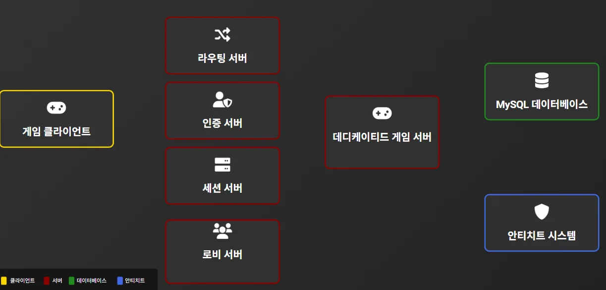

# 🎮 마피아 게임 - 멀티플레이어 게임 서버 시스템

## 📋 프로젝트 개요
언리얼 엔진 5.4 기반의 6인 멀티플레이어 마피아 게임 프로젝트입니다.  
분산 서버 아키텍처와 **커널 드라이버 기반 안티치트 시스템**을 포함한 풀스택 게임 개발 포트폴리오입니다.

## 🏗️ 시스템 아키텍처



## 🎯 주요 기능

### 1️⃣ 서버 시스템
- **인증 서버**: 회원가입/로그인, MySQL 연동, AES 암호화
- **라우팅 서버**: 로드밸런싱, 서버 등록/관리
- **세션 관리 서버**: 세션 검증, 하드웨어 정보 수집 (안티치트)
- **게임 로비 서버**: 매칭 시스템, 데디케이티드 서버 할당 , 커널안티치트 관리
- **언리얼 5.4 데디케이티드 서버**: 게임 로직 실행

### 2️⃣ 클라이언트
- **DirectX11 + ImGui**: 커스텀 GUI 시스템
- **WSAEventSelect 비동기 소켓**: 논블로킹 네트워크
- **Thread Pool 패킷 처리**: AES 암호화/복호화
- **커널 드라이버 안티치트**: 프로세스 보호, 하드웨어 정보 수집, 코드 무결성 검증

### 3️⃣ 게임 시스템
- **6인 플레이어**: 마피아 1명, 경찰 1명, 탐정 1명, 시민 3명
- **페이즈 시스템**: 밤(행동) → 아침(결과) → 투표 → 유언 → 게임종료
- **네트워크 복제**: Unreal Engine Replication 시스템
- **RPC**: Server/Client/Multicast RPC

## 🛠️ 기술 스택

### 서버
- **언어**: C++17
- **네트워크**: Epoll (Linux), WSAEventSelect (Windows)
- **데이터베이스**: MySQL 8.0
- **암호화**: AES-256
- **패킷**: 커스텀 바이너리 직렬화

### 클라이언트
- **언어**: C++17
- **GUI**: DirectX11, ImGui, WIC (GIF 애니메이션)
- **네트워크**: WSAEventSelect (비동기 소켓)
- **안티치트**: Windows Kernel Driver (WDK)

### 게임
- **엔진**: Unreal Engine 5.4
- **언어**: C++
- **네트워크**: UE5 Replication, RPC
- **입력**: Enhanced Input System

## 📂 프로젝트 구조

```
├── Server/
│   ├── AuthServer/              # 인증 서버
│   │   ├── Network.h/cpp        # Epoll 네트워크 엔진
│   │   ├── RoutineProgress.h/cpp # Thread Pool 패킷 처리
│   │   └── MafiaDatabase.h/cpp  # MySQL 연동
│   │
│   ├── RoutingServer/           # 라우팅 서버
│   │   ├── Network.h/cpp
│   │   ├── ServerRegistry.h/cpp # 서버 등록/관리
│   │   └── RoutineProgress.h/cpp
│   │
│   ├── SessionServer/           # 세션 관리 서버
│   │   ├── SessionServer_Network.h/cpp
│   │   ├── SessionManager.h/cpp # 세션 검증
│   │   └── ClientInfo.h/cpp     # 하드웨어 정보 관리
│   │
│   ├── GameLobbyServer/         # 게임 로비 서버
│   │   ├── GameLobby_Network.h/cpp
│   │   ├── DedicatedManger.h/cpp # 데디서버 할당
│   │   ├── GameRoom.h/cpp       # 매칭 시스템
│   │   └── SessionServerConnector.h/cpp # 세션서버 연결
│   │
│   └── UE5_DedicatedServer/     # 언리얼 5.4 데디서버
│       ├── DedicatedGameMode.h/cpp
│       ├── MafiaGameState.h/cpp
│       ├── MafiaPlayerState.h/cpp
│       ├── DedicatedCharacter.h/cpp
│       └── ServerConnector.h/cpp
│
├── Client/
│   ├── Network/
│   │   ├── NetWork.h/cpp        # WSAEventSelect 비동기 소켓
│   │   └── RoutineProgress.h/cpp # Thread Pool 패킷 처리
│   │
│   ├── AntiCheat/
│   │   ├── AntiCheat.h/cpp      # 커널 드라이버 통신
│   │   └── offset.h             # IOCTL 정의
│   │
│   ├── GUI/
│   │   ├── GuiControl.h/cpp     # DirectX11, ImGui
│   │   ├── InitGui.h/cpp
│   │   ├── LoginGui.h/cpp
│   │   ├── LobbyGui.h/cpp
│   │   ├── MatchingGui.h/cpp
│   │   └── GameGui.h/cpp
│   │
│   ├── Core/
│   │   ├── Core.h/cpp           # 이벤트 매니저, 초기화
│   │   ├── EventManager.h/cpp   # 함수 포인터 기반 이벤트
│   │   └── ProcessHandler.h/cpp # SEH 예외 처리
│   │
│   └── ProcessManager/
│       └── ProcessManager.h/cpp # UE5 게임 실행
│
└── AntiCheat_Driver/             # 커널 드라이버 (Flect)
    ├── main.c                    # 드라이버 엔트리 포인트
    ├── ProcessGuard.h/c          # ObRegisterCallbacks 프로세스 보호
    ├── GetHardware.h/c           # SMBIOS 하드웨어 정보 수집
    ├── crc.h/c                   # CRC32 코드 무결성 검증
    └── Context/
        ├── HwSecurityProtocol.h  # IOCTL 프로토콜 정의
        ├── HardWareContext.h     # SMBIOS 구조체
        ├── SecurityAccessFlags.h # 차단 권한 정의
        └── ProcessCodeHash.h     # 코드 해시 구조체
```

## 🛡️ 안티치트 시스템 (커널 드라이버)

### 아키텍처
```
[게임 클라이언트]
       ↓
[안티치트 클라이언트] ← DeviceIoControl (IOCTL)
       ↓
[Flect.sys 커널 드라이버]
       ├── ObRegisterCallbacks (프로세스 보호)
       ├── SMBIOS 파싱 (하드웨어 정보)
       └── CRC32 무결성 검증 (코드 변조 탐지)
```

### 1. ObRegisterCallbacks 프로세스 보호

**핵심 기능:**
- 프로세스/스레드 핸들 후킹
- 위험한 접근 권한 차단 (PROCESS_VM_WRITE, PROCESS_VM_OPERATION, THREAD_SET_CONTEXT 등)
- 공격 시도 실시간 로깅

**구현 세부:**
```c
// 차단하는 위험 권한
#define PROTECT_FULL_ACCESS ( \
    PROCESS_CREATE_PROCESS | \
    PROCESS_CREATE_THREAD | \
    PROCESS_VM_OPERATION | \
    PROCESS_VM_READ | \
    PROCESS_VM_WRITE | \
    PROCESS_SET_INFORMATION | \
    PROCESS_SUSPEND_RESUME | \
    PROCESS_TERMINATE \
)

// 핸들 생성 전 콜백
OB_PREOP_CALLBACK_STATUS PreOperationCallback() {
    // 보호 대상 프로세스 확인
    if (IsProcessProtected(TargetPID)) {
        // 위험한 권한 요청 시 차단
        if (DesiredAccess & PROTECT_FULL_ACCESS) {
            DesiredAccess = 0;  // 권한을 0으로 설정하여 차단
        }
    }
}

// 핸들 생성 후 콜백 (공격 시도 로깅)
VOID PostOperationCallback() {
    // 공격자 프로세스 정보 수집
    // - PID, 프로세스 이름, 요청한 권한
    AddSecurityAlert(AttackerPID, TargetPID, processName, grantedAccess);
}
```

**보호 범위:**
- 프로세스 핸들: VM_WRITE, VM_OPERATION, TERMINATE, SUSPEND 등
- 스레드 핸들: SET_CONTEXT, SUSPEND_RESUME, TERMINATE 등

### 2. SMBIOS 하드웨어 핑거프린팅

**핵심 기능:**
- 물리 메모리(0xF0000~0xFFFFF) 영역에서 SMBIOS 테이블 파싱
- 메인보드 UUID 추출 (SMBIOS Type 1)
- CPU ID 추출 (SMBIOS Type 4, 중복 제거)

**구현 세부:**
```c
// SMBIOS 엔트리 포인트 검색
PHYSICAL_ADDRESS physicalAddress;
physicalAddress.QuadPart = 0xF0000;
PVOID mappedAddress = MmMapIoSpace(physicalAddress, 0x10000, MmNonCached);

// "_SM_" 시그니처 검색 (16바이트 단위)
for (ULONG offset = 0; offset < 0x10000; offset += 16) {
    if (RtlCompareMemory(candidate->Anchor, "_SM_", 4) == 4) {
        // 체크섬 검증
        if (checksum == 0) {
            entryPoint = candidate;
            break;
        }
    }
}

// Type 1: System Information (메인보드 UUID)
PSMBIOS_SYSTEM_INFO sysInfo = (PSMBIOS_SYSTEM_INFO)header;
// UUID를 16진수 문자열로 변환 (예: 12345678-ABCD-EFGH-IJKL-MNOPQRSTUVWX)

// Type 4: Processor (CPU ID)
PSMBIOS_PROCESSOR_INFO procInfo = (PSMBIOS_PROCESSOR_INFO)header;
// ProcessorID를 16진수 문자열로 변환 (중복 제거)
```

**데이터 전송:**
- TLV (Type-Length-Value) 구조로 응답 메시지 생성
- 유저모드 클라이언트로 전송
- 서버로 세션 검증 시 함께 전송

### 3. CRC32 코드 무결성 검증

**핵심 기능:**
- PE 파일의 .text 및 .rdata 섹션을 256바이트 단위로 분할
- 각 청크마다 CRC32 해시 생성 및 저장
- 10초마다 메모리 재검증하여 코드 변조 탐지

**구현 세부:**
```c
// CRC32 테이블 초기화 (0xEDB88320 다항식)
VOID InitializeCRC32Table(VOID) {
    for (ULONG i = 0; i < 256; i++) {
        ULONG crc = i;
        for (ULONG j = 0; j < 8; j++) {
            if (crc & 1) {
                crc = (crc >> 1) ^ 0xEDB88320;
            } else {
                crc >>= 1;
            }
        }
        CRC32Table[i] = crc;
    }
}

// PE 섹션 찾기 (.text, .rdata)
ULONG FindCodeSections(PEPROCESS Process, PVOID ImageBase, CODE_SECTION_INFO Sections[2]) {
    // DOS 헤더 검증
    PIMAGE_DOS_HEADER dosHeader = (PIMAGE_DOS_HEADER)ImageBase;
    
    // NT 헤더 검증
    PIMAGE_NT_HEADERS64 ntHeaders = ...;
    
    // 섹션 헤더 순회
    for (USHORT i = 0; i < numberOfSections; i++) {
        if (isText || isRdata) {
            Sections[foundCount].Address = (PUCHAR)ImageBase + sectionHeader[i].VirtualAddress;
            Sections[foundCount].Size = sectionHeader[i].Misc.VirtualSize;
            foundCount++;
        }
    }
}

// 256바이트 청크로 분할하여 CRC32 해시 생성
NTSTATUS AddCRC(HANDLE ProcessId) {
    for (ULONG s = 0; s < sectionCount; s++) {
        ULONG chunkCount = (sectionSize + 256 - 1) / 256;
        
        for (ULONG i = 0; i < chunkCount; i++) {
            // 프로세스 메모리 읽기 (MmCopyVirtualMemory)
            ReadProcessMemory(process, chunkAddress, codeBuffer, currentChunkSize);
            
            // CRC32 해시 계산 및 저장
            hashValues[hashIndex] = CalculateCRC32(codeBuffer, currentChunkSize);
        }
    }
}

// 10초마다 재검증
VOID IntegrityCheckThreadRoutine(PVOID Context) {
    while (g_IntegrityCheckRunning) {
        for (ULONG i = 0; i < g_process_code_hashCount; i++) {
            // 메모리 재읽기 및 CRC32 재계산
            ULONG currentHash = CalculateCRC32(codeBuffer, currentChunkSize);
            
            // 원본 해시와 비교
            if (currentHash != hashInfo->HashValues[hashIndex]) {
                DbgPrint("[MemoryChanged] Code modification detected!\n");
                // 추가 조치 (프로세스 종료, 서버 알림 등)
            }
        }
        
        // 10초 대기
        KeDelayExecutionThread(KernelMode, FALSE, &interval);
    }
}
```

**검증 프로세스:**
1. 게임 시작 시 .text/.rdata 섹션의 초기 CRC32 해시 생성
2. 10초마다 동일 영역 재검증
3. 해시 불일치 시 메모리 변조 탐지
4. 서버로 알림 또는 게임 종료

### 4. 클라이언트-드라이버 통신

**IOCTL 프로토콜:**
```c
// 하드웨어 정보 요청
#define IOCTL_HARDWARE_GET_INFO     CTL_CODE(FILE_DEVICE_UNKNOWN, 0x800, METHOD_BUFFERED, FILE_ANY_ACCESS)

// 하트비트 체크
#define IOCTL_HARDWARE_HEARTBEAT    CTL_CODE(FILE_DEVICE_UNKNOWN, 0x801, METHOD_BUFFERED, FILE_ANY_ACCESS)

// 보안 제어 (ObRegisterCallbacks, PID 추가, 공격 로그 조회)
#define IOCTL_SECURITY_CONTROL      CTL_CODE(FILE_DEVICE_UNKNOWN, 0x802, METHOD_BUFFERED, FILE_ANY_ACCESS)
```

**통신 플로우:**
```
1. CreateFileW(\\\\.\\Flect) - 드라이버 연결
2. DeviceIoControl(IOCTL_SECURITY_CONTROL, OB_REGISTER) - ObRegisterCallbacks 활성화
3. DeviceIoControl(IOCTL_SECURITY_CONTROL, ADD_PID) - 프로세스 보호 등록
4. DeviceIoControl(IOCTL_HARDWARE_GET_INFO) - 하드웨어 정보 수집
5. 게임 중: DeviceIoControl(IOCTL_HARDWARE_HEARTBEAT) - 5초마다 하트비트
6. 게임 중: DeviceIoControl(IOCTL_SECURITY_CONTROL, GET_ALERTS) - 공격 로그 조회
7. CloseHandle() - 드라이버 연결 해제
```

### 클라이언트-서버 연동

**인증 플로우:**
```
1. 로그인 성공 → 세션 토큰 발급
2. 안티치트 시작:
   - 드라이버 서비스 등록 (SC_MANAGER)
   - 드라이버 시작 (StartService)
   - ObRegisterCallbacks 활성화
   - 프로세스 PID 등록
3. SMBIOS 하드웨어 정보 수집:
   - 메인보드 UUID (SMBIOS Type 1)
   - CPU ID (SMBIOS Type 4)
4. 세션 서버로 전송:
   - 세션 토큰 + 하드웨어 정보
   - 서버에서 세션 검증 + 하드웨어 정보 저장
5. 게임 로비 서버 접속 허용
6. 게임 중 하트비트 체크:
   - 클라이언트: 5초마다 드라이버 하트비트 체크
   - 서버 요청 시: 드라이버 상태 + 공격 로그 전송
```

**서버 검증:**
- 세션 토큰 유효성 확인
- 하드웨어 정보 중복 확인 (다중 접속 방지)
- 하트비트 실패 시 연결 종료

## 🎮 게임 플로우

### 1. 플레이어 접속
```
1. 라우팅 서버 접속 (포트 8000)
2. 인증 서버 IP 획득
3. 로그인 → 세션 토큰 발급
4. 안티치트 시작 → 하드웨어 정보 수집
5. 게임 로비 서버 접속 (포트 8020)
6. 세션 검증 (세션 서버와 통신)
```

### 2. 매칭 및 게임 시작
```
1. 게임 참가 (닉네임 입력)
2. 6명 매칭 대기
3. 데디케이티드 서버 할당
4. UE5 게임 클라이언트 실행
5. 세션 토큰으로 데디서버 접속
```

### 3. 게임 진행
```
[대기 페이즈] 6명 접속 대기
    ↓
[직업 할당] 마피아 2, 경찰 1, 탐정 1, 시민 2
    ↓
[밤 페이즈 30초] 마피아(시민 죽임), 경찰(조사), 탐정(조사)
    ↓
[아침 페이즈 30초] 밤 결과 공개
    ↓
[투표 페이즈 30초] 처형 대상 투표
    ↓
[유언 페이즈 10초] 처형 대상의 유언
    ↓
[승리 조건 체크] 마피아 전멸 or 마피아 ≥ 시민팀
```

## 📊 네트워크 프로토콜

### 패킷 구조
```cpp
[Header: PacketType(1byte)] + [Body: Binary Serialized Data]
```

### 암호화
- **AES-256-CBC**: 모든 패킷 암호화
- **세션 토큰**: SHA-256 해시 (64자)

### 주요 패킷
- `FindAccountServerRequest/Response`: 인증 서버 IP 요청
- `LoginRequest/Response`: 로그인
- `RegisterRequest/Response`: 회원가입
- `TryConnectLobbyServerRequest/Response`: 게임 로비 서버 세션 검증
- `IntegrityCheckPacket`: 하드웨어 정보 전송 (메인보드 UUID + CPU ID)
- `JoinRoomRequest/Response`: 게임 참가
- `CancelRoomRequest/Response`: 매칭 취소
- `GameCreate`: 게임 시작 (데디서버 IP/포트)
- `HeartbeatRequest/Response`: 안티치트 하트비트
- `AntiEventRequest`: 공격 시도 로그 전송

## 🚀 빌드 및 실행

### 서버 (Linux)
```bash
# 인증 서버
cd AuthServer
make
./AuthServer

# 라우팅 서버
cd RoutingServer
make
./RoutingServer

# 세션 관리 서버
cd SessionServer
make
./SessionServer

# 게임 로비 서버
cd GameLobbyServer
make
./GameLobbyServer

# UE5 데디케이티드 서버
cd UE5_DedicatedServer
./MafiaGameServer.sh
```

### 클라이언트 (Windows)
```bash
# Visual Studio 2022
1. Client.sln 열기
2. Release/x64 빌드
3. 실행 파일 경로에 fonts/, GIF/, Anticheat/ 복사
4. MafiaGameClient.exe 실행
```

### 안티치트 드라이버 (Windows)
```bash
# Windows Driver Kit (WDK) 필요
1. Visual Studio 2019 + WDK 설치
2. AntiCheat_Driver.sln 열기
3. Release/x64 빌드
4. 테스트 서명 모드 활성화:
   bcdedit /set testsigning on
5. 드라이버 서비스 등록 (클라이언트가 자동 수행)
```

## 📈 성능

- **동시 접속자**: 10,000명 이상 (Epoll 기반)
- **세션 관리**: 100,000개 세션 캐싱
- **패킷 처리**: Thread Pool (워커 스레드 8개)
- **네트워크 지연**: 평균 10ms 이하 (로컬 테스트)
- **안티치트 오버헤드**: 
  - ObRegisterCallbacks: 핸들 생성 시 < 1ms
  - 하드웨어 정보 수집: 초기 1회 < 50ms
  - CRC32 무결성 검증: 10초마다 < 100ms

## 📝 주요 기술적 특징

### 1. 비동기 네트워크
- **Epoll (Linux)**: Edge-triggered, 논블로킹
- **WSAEventSelect (Windows)**: FD_CONNECT, FD_READ, FD_CLOSE

### 2. Thread Pool 패킷 처리
- Producer-Consumer 패턴
- Condition Variable을 통한 워커 스레드 관리
- Mutex로 큐 동기화

### 3. 커스텀 바이너리 직렬화
- Zero-copy 최적화
- 가변 길이 인코딩 (Compact Binary)

### 4. 메모리 풀
- 패킷 메모리 풀 (재사용)
- 클라이언트 정보 캐싱

### 5. 이벤트 기반 아키텍처
- 함수 포인터 기반 이벤트 시스템
- SEH 예외 처리 통합
- 스레드별 이벤트 처리 (wait/detach)

### 6. 커널 레벨 안티치트
- **ObRegisterCallbacks**: 프로세스/스레드 핸들 후킹
- **SMBIOS 파싱**: 물리 메모리 직접 접근
- **CRC32 무결성 검증**: 256바이트 단위 코드 해시
- **IOCTL 통신**: 유저모드-커널모드 양방향 통신
- **스핀락/뮤텍스**: 멀티프로세서 동기화

## 🔧 개발 환경

- **OS**: Ubuntu 24.04 (Server), Windows 10 (Client)
- **IDE**: Visual Studio Code, Visual Studio 2022 , Visual Studio 2019
- **컴파일러**: GCC 13.2.0, MSVC 19.39
- **빌드 시스템**: Makefile, MSBuild
- **버전 관리**: Git
- **드라이버**: Windows Driver Kit (WDK) 10.0.22000.1

## 🔒 보안 고려사항

### 내 안티치트 한계
- **테스트 서명 모드 필요**: 실제 배포 시 WHQL 인증 필요
- **커널 드라이버 우회 가능성**: 드라이버 탐지 검사를 별도로 수행하지 않음
- **CRC32 한계**: CRC 무결성 검사는 타겟 프로세스에만 적용
- **미니 필터 드라이버 후킹**: 미니 필터 드라이버를 통한 IRP 후킹 등 커널 기반 공격은 탐지 어려움


## 📞 연락처


- **Email**: [tlkj12@gmail.com]
- **Portfolio**: [여기에 포트폴리오 주소]

## 📄 라이선스

이 프로젝트는 포트폴리오 목적으로 제작되었습니다.

---

